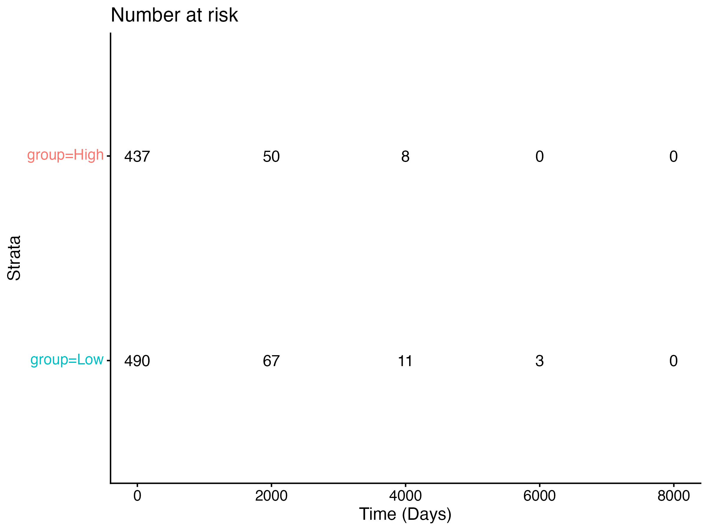

# breast-cancer-biomarker-analysis
Logistic regression analysis of tumor biomarkers predicting breast cancer malignancy using the Wisconsin Breast Cancer dataset.
## Dataset

This analysis uses the Wisconsin Breast Cancer dataset, which contains clinical and morphological measurements of breast tumors.  
The dataset includes tumor biomarker features derived from digitized images of breast mass cell nuclei.

The outcome variable is **tumor diagnosis**, classified as:

- **Malignant (M)**
- **Benign (B)**

A binary outcome variable was created for logistic regression analysis:

- 1 = Malignant tumor
- 0 = Benign tumor

Key biomarker predictors evaluated in this analysis include:

- Mean tumor radius
- Mean tumor texture
- Mean tumor area

The dataset contains **569 observations** and **33 variables**.

---

## Methods

### Logistic Regression Model

A logistic regression model was used to evaluate the association between tumor biomarker measurements and the probability of a tumor being malignant.

The following predictors were included:

- Mean tumor radius
- Mean tumor texture
- Mean tumor area

The model estimates the **odds of malignancy** associated with each biomarker.

### Odds Ratio Estimation

Odds ratios (ORs) and 95% confidence intervals were calculated by exponentiating the regression coefficients.

These estimates quantify how changes in tumor biomarker values influence the likelihood of malignancy.

---

## Results

The logistic regression analysis identified tumor biomarker measurements associated with breast cancer malignancy.

Tumor **texture** showed a positive association with malignancy risk, while tumor **radius** and **area** demonstrated weaker associations in this simplified model.

Odds ratios and confidence intervals were visualized using a forest plot to illustrate the magnitude and direction of biomarker effects.
Results

## Results

Kaplan–Meier survival analysis was performed to evaluate the association 
between ERBB2 expression and overall survival in TCGA breast cancer patients.

Patients were stratified into high and low expression groups using the median 
ERBB2 expression level.

While the high expression group demonstrated a trend toward poorer survival, 
the difference was not statistically significant (log-rank p = 0.075).

Cox proportional hazards modeling also did not identify ERBB2 expression as a
significant predictor of overall survival (HR = 0.94, 95% CI 0.82–1.07, p = 0.316).

---

## Figure

### Biomarker Odds Ratio Forest Plot

This figure displays estimated odds ratios and 95% confidence intervals for each tumor biomarker included in the logistic regression model.

Values greater than 1 indicate an increased odds of malignancy associated with higher biomarker measurements.

---

## Tools Used

- **R**
- **tidyverse**
- **broom**
- **ggplot2**

---

## Project Structure
